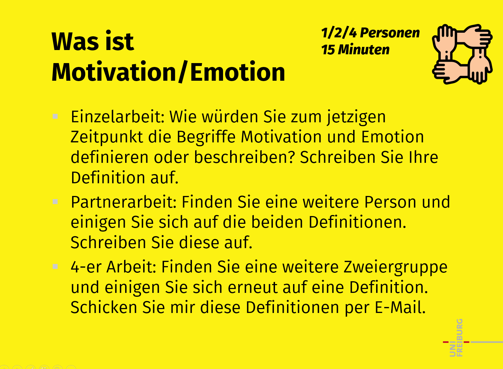

## Was ist Motivation?

Die Gesamtheit aller Einflussfaktoren auf einen Entscheidungsprozess, um ein bestimmtes Ziel zu erreichen. 

Motivation ist der innere Antrieb eine Sache zu tun.

Motivation ist der Antrieb zielorientierten Handelns, dieser Antrieb kann aus dem Individuum heraus selbst kommen (intrinsisch) oder von außen (extrinsisch) kommen. Motivation ist in der Regel positiv konnotiert.

innerer Beweggrund, der das Handeln und Denken beeinflusst

innere Kraft/ Energie + Stimmung oder Beweggrund, welcher dazu führt, dass man geistig aufwendige Aufgaben auf sich nimmt und seine Zeit dieser Aufgabe widmet; kann spontan auftreten, aber auch über einen längeren Zeitraum anhalten und auf ein spezifisches Ziel gerichtet sein

## Was ist Emotion?

Gefühlswelt bzw. das innere Erleben bei bestimmten Handlungen, Erlebnissen und Prozessen. 

Emotionen sind Gefühlsregungen die durch eine Situation ausgelöst werden. 

Emotionen sind hormongesteuerte Gefühlszustände basierend auf Ereignissen der äußeren Welt oder inneren Faktoren.

über die Zeit veränderliche Gefühlslage (sowohl positiv als auch negativ), in der sich eine Person befindet; ausgelöst durch Erlebnisse, Erfahrungen oder Gedanken

Gefühlsausdruck; kann Motivation positiv oder negativ beeinflussen; entsteht durch Erfahrungen und wird durch einen Auslöser hervorgerufen