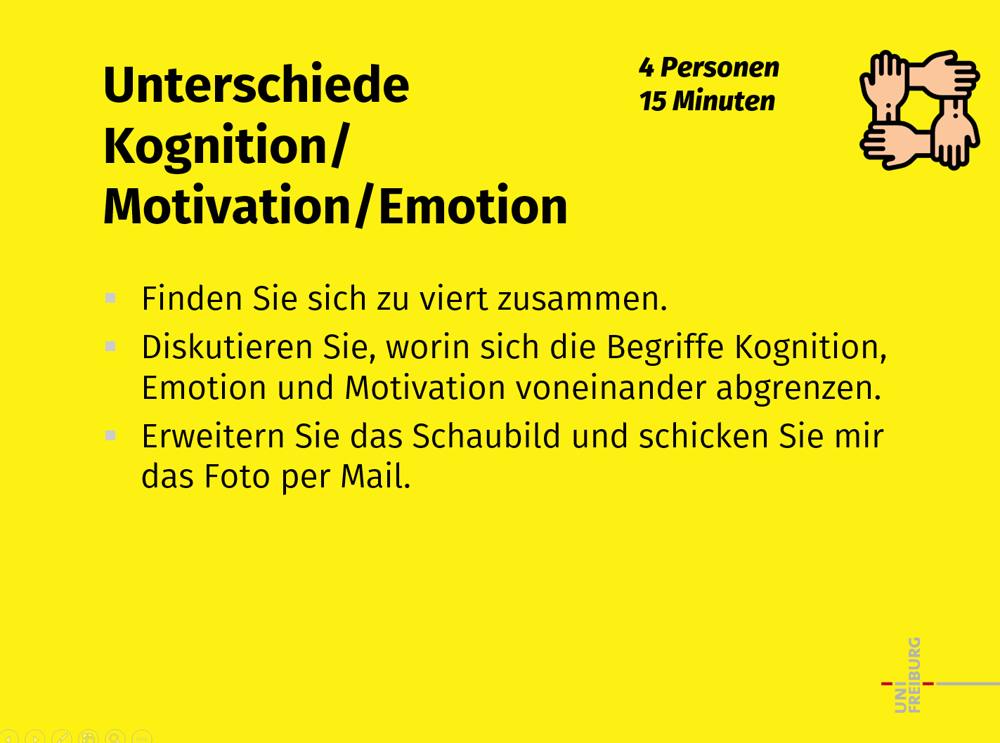
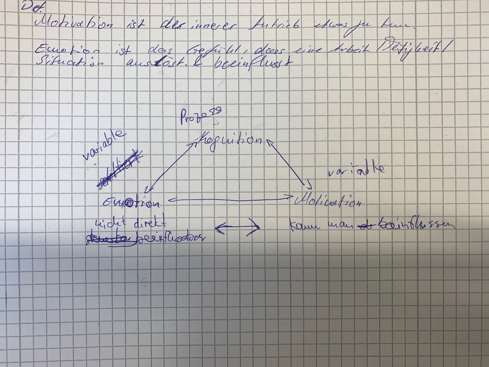
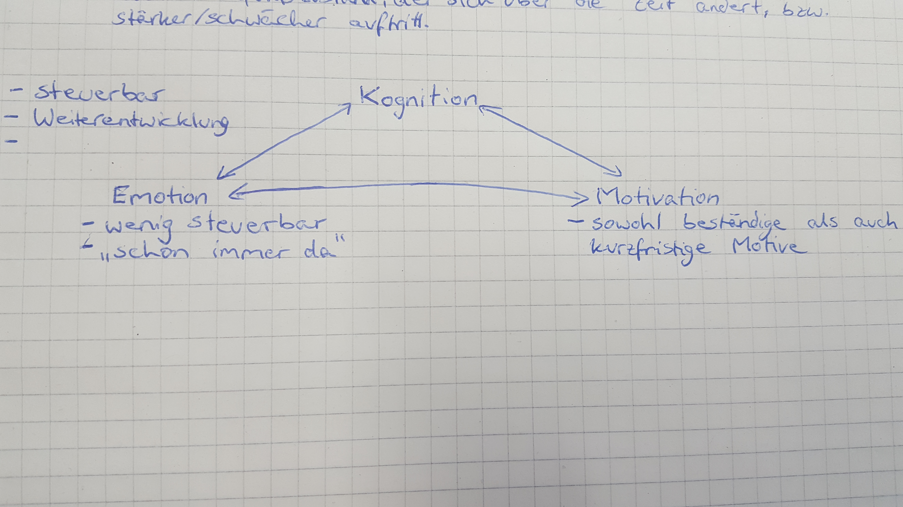

Kognition beansprucht Arbeitsressourcen, die für bestimmte Prozesse notwendig sind. Losgelöst vom inneren Erleben und der Gefühlswelt. Kognition ist faktenbasiert, rational und logisch wohingegen Emotion und Motivation gefühlsbasiert und fremdgesteuert sind. Emotionen sind das Resultat einer bestimmt-motivierten Handlung. Motivation bedingt eine Handlung, welche Kognition beansprucht und schlussendlich eine Emotion zur Folge hat. 

Kognition umfasst die geistigen Prozesse, welche sich in erster Linie das Aneignen neuen Wissens/ Abrufen bereits bestehenden Wissens und deren Verknüpfung miteinander bezieht

Emotionen: im Gegensatz zur Kognition geht es nicht um das reine Faktenwissen, sondern um Auslöser für Erfahrungen/Wissen welche mit Emotionen angereichert sind
 
Motivation gründet (direkt/indirekt) auf Emotionen.
