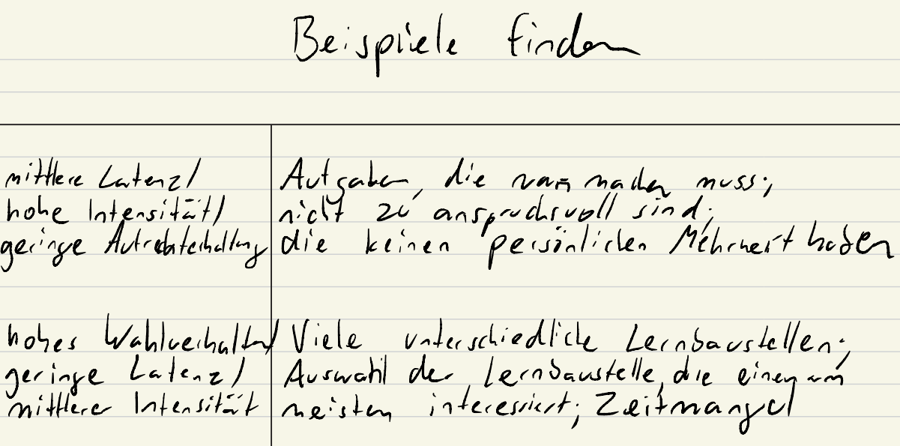
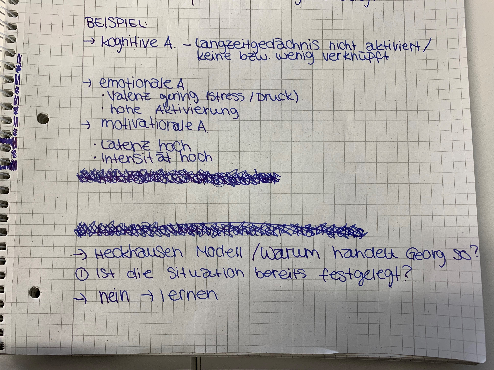
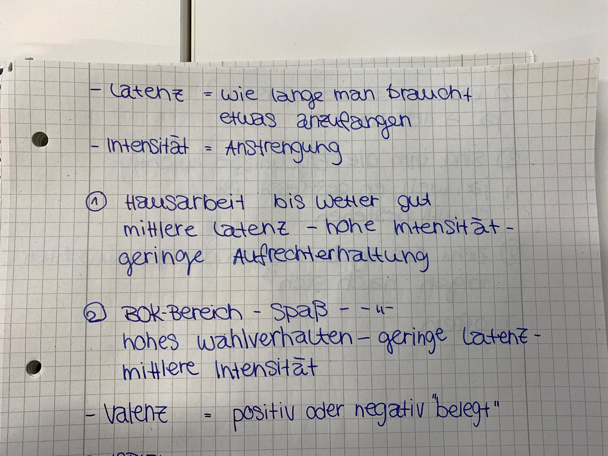

Ein Fallbeispiel: Georg 

1)	Motivationsmodell nach Heckhausen: 
1.	Person: Bedürfnis die Klausur zu bestehen und versetzt zu werden (nichts mehr mit dem Thema zu tun haben) 
2.	Situation: Klausur die bestanden werden muss
3.	Person x Situation: Interaktion: anfängliche Motivation für die Klausur zu lernen
4.	Handlung: Georg prokrastiniert anstatt zu lernen.
5.	Ergebnis: Angst die Klausur nicht bestanden zu haben
6.	Folgen: Langfristiges Ziel die Klausur zu bestehen und nichts mehr mit dem Thema zu tun zu haben ist gefährdet, negative Fremd-/ und Selbstbewertung

2)	Kognitive, emotionale und motivationale Aspekte
2.1) Emotion
Dimensionaler Ansatz: 
negative Valenz: Georg fühlt sich mies, da er Angst hat die Klausur nicht zu bestehen. 
Geringe Intensität/Aktivität: Georg lernt weder aktiv noch intensiv für die Klausr, sondern prokrastiniert.

Kategorialer Ansatz: Ärger über sich selbst, dass er sich nicht ausreichend vorbereitet hat und Angst, die Klausur nicht bestanden zu haben. 

2.2) Motivation
Sehr hohe Latenz: Prokrastination bis kurz vor der Klausur
Geringe Intensität: Georg lernt nicht intensiv
Geringen Aufrechterhaltung: Georg fängt nicht früh genug mit der Klausurvorbereitung an.

Das Ergebnis ist nicht festgelegt, er kann es durch sein eigenes Handeln beeinflussen, auch hinreichend.
Die Folgen des Ergebnisses sind ihm wichtig, da er die Klausur bestehen will.
Das Ergebnis würde auch die erwünschten Folgen nach sich ziehen, Georg würde die Klausur bestehen. 
	Es lässt sich alles mit „Ja“ beantworten, aber Georg sind die Folgen vermutlich nicht wichtig genug. 

2.3) Kognition
Georg interessiert sich wenig für das Thema, dies führt zu einer hohen kognitiven Belastung. (extrinsisch wie intrinsisch)

