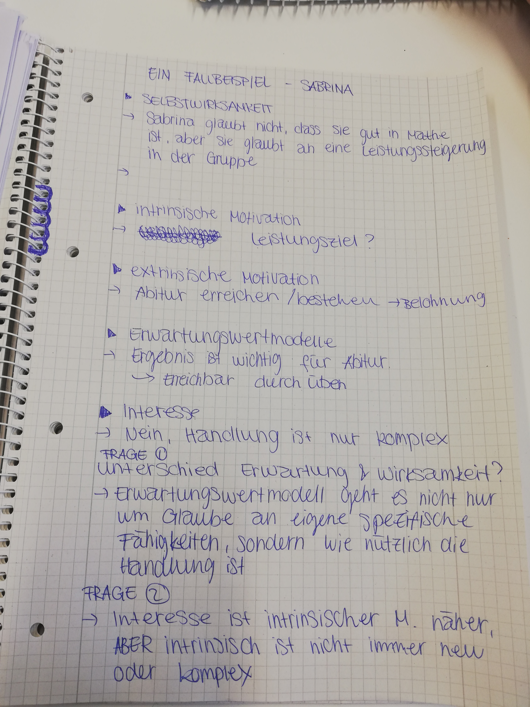
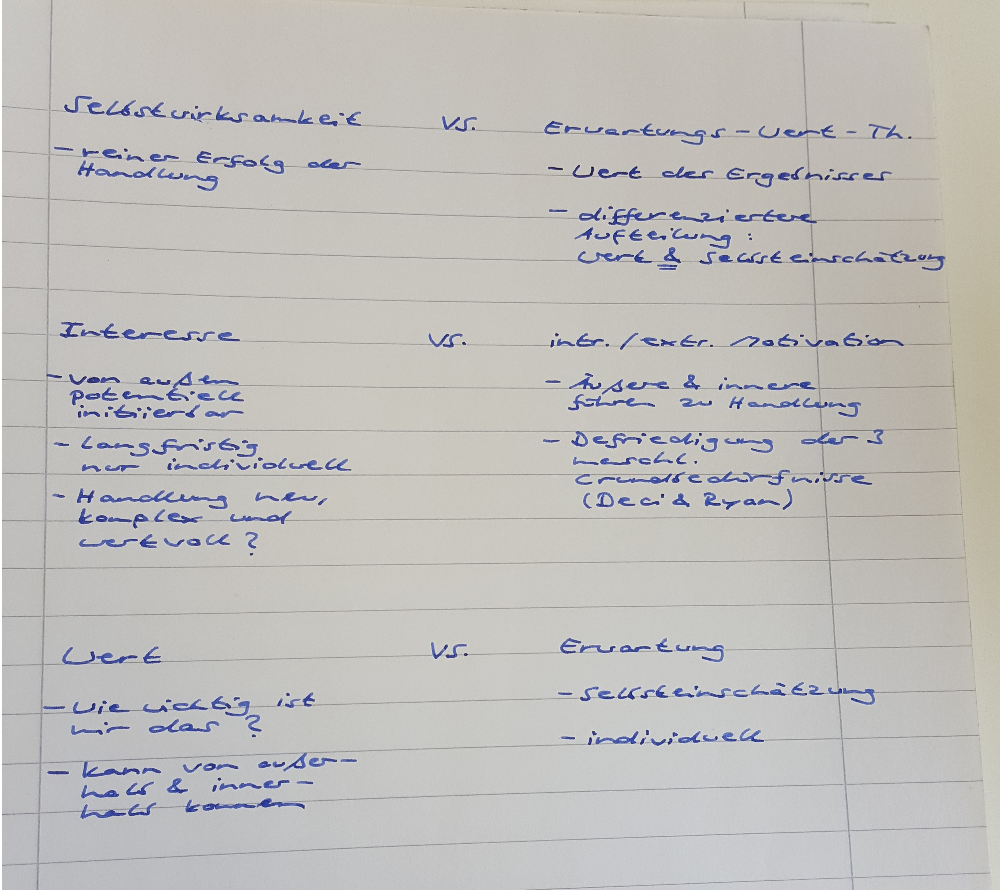

## Antwort 1

Erwartungs-Wert-Theorie: Kosten-Nutzen-Abschätzung 
Selbstwirksamkeitstheorie: subjektive Kompetenzabschätzung 

Unterschied Interesse und int./ext. Motivation: Interesse ist immer intern attributiert, während int./ext. Motivation auch extern attributiert werden kann. 

Erwartung als vorausschauende Annahme, wohingegen ein Wert ein zu Grunde liegendes System darstellen kann.  

## Antwort 2

1)
SW: Kann ich etwas erfolgreich tun?
EW: 1. Schritt: Bewertung der Situation. 2. Schritt: Kann ich überhaupt etwas tun? Habe ich bspw. die benötigten Ressourcen (zB Zeit)?
2)
Das Interesse ist sach-/domänenbezogen, int./ext. Motivation ist das auf das Resultat des subjektiven Handeln bezogen
3)
Wert: auf Nützlichkeit der Handlung bezogen
Erwartung: Inwiefern besitze ich die Kompetenz zum Handlungsvollzug?

## Antwort 3

1.	Worin unterscheidet sich die Selbstwirksamkeitstheorie von der Erwartungs-Wert-Theorie?
Der Unterschied liegt darin, dass es bei der Selbstwirksamkeitstheorie nicht um den Wert der Handlung geht. Der Nutzen der Handlung wird demnach außen vorgelassen. 
2.	Worin liegt der Unterschied zwischen Interesse und der Theorie der intrinsischen/extrinsischen Motivation? 
Die intrinsische Motivation muss nicht neu sein, um immer noch zu motivieren und gleichzeitig muss man für das Interesse in einem bestimmten Gebiet nicht autonom, kompetent oder sozial eingebunden sein.
3.	Worin besteht der Unterschied zwischen einem Wert und einer Erwartung?

## Antwort 4

Ein Fallbeispiel:

Selbstwirksamkeit: Sabrinas Selbstwirksamkeit ist bei den Textaufgaben sehr ausgeprägt, da sie sich über ihre Fähigkeiten, diese gut zu lösen, bewusst ist. Auf  der anderen Seite ist ihr auch bewusst, dass das Ableiten von Funktionen nicht zu ihren Stärken gehört. 
Interesse: Sabrinas Interesse an Mathematik hält sich in Grenzen, jedoch hat sie Interesse daran, Textaufgaben so gut wie möglich zu lösen und somit einen guten Abschluss zu machen. 
Intr./extr. Motivation: Extrinsisch motiviert durch: 
- Zeitdruck (drei Wochen bis zur Klausur)
- Lerngruppe (mit den anderen macht es mehr Spaß)
Intrinsisch motiviert durch: 
- teilweise besser als andere in Lerngruppe (mehr Mühe, es spornt sie an, besser zu bleiben)
 
Worin unterscheidet sich die Selbstwirksamkeitstheorie von der Erwartungs-Wert-Theorie?
Selbstwirksamkeitstheorie: Welche Fähigkeiten besitze ich um eine Handlung erfolgreich auszuführen? 
Erwartungs-Wert-Theorie: Welchen Wert hat das durch die Handlung entstehende Ereignis für mich? 
Worin liegt der Unterschied zwischen Interesse und der Theorie der int./extr. Motivation?
Ein Interesse ist immer subjektiv, Interesse kann zwar geweckt werden, danach ist es aber auch Interesse der betroffenen Person. Interesse richtet sich an eine Sache oder ein Empfinden.

Intrinsische Motivation kann man mit Interesse vergleichen, weil man sich durch Interesse an etwas intrinsisch motivieren kann und so zum Lernerfolg kommt. Extrinsische Motivation hat immer externen Einfluss, demnach kann extrinsische Motivation nie eigenes Interesse sein, sonst würden der Lernerfolg bzw. das Lernen allgemein nicht von äußeren Faktoren bestimmt sein.

Worin besteht der Unterschied zwischen einem Wert und einer Erwartung in den Motivationstheorien?  
Wert:
Erwartung: 
Erwarte ich, dass ich die Handlung ausführen kann
Wert: 
Hat das Ergebnis für mich einen Wert, sodass ich es können/machen möchte 

Der Wert ist bereits zielorientiert (nützlich ja/nein) und 

 

## Antwort 5

1) Selbstwirksamkeits-Theorie
Sabrina ist der Meinung, dass sie im Monat( 3 Wochen) vor dem Matheabitur noch einige Schwierigkeiten hat, die sie Teilwiese niederschlagen und sehr erschöpfend sind. Allerdings hat sie auch Stärken, an denen sie festhält und  noch genügend Zeit, um mithilfe der anderen an ihren Schwächen zu arbeiten. Sie steckt also viel Zeit und Kraft in ihre Vorbereitung, da sie davon ausgeht, das Matheabitur zu bestehen( vermutlich auch bestmöglich).

2) Interesse:
Individual/personal interest (stable attribute)
Situational interest (psychological state that arises spontaneously)
Wie ist das Lernverhalten von Sabrina auf Grundlage der Interessens-Theorie zu erklären?
Bei Sabrina liegt beides ein bisschen vor. Sie ist bereit dazu, sich drei Wochen lang intensiv und immer wieder mit dem Mathestoff zu beschäftigen. Situational interest könnte beispielsweise beim Lernen in der Lerngruppe auftreten (wenn alle an einem Strang ziehen, einer ihrer Lernpartner etwas vorbereitet hat, das ihr beim Lernen hilft, sie ein Erfolgserlebnis hat und weitermachen möchte…)
Es herrscht eine entscheidende Verbindung zu der anstehenden Prüfung, wodurch ihr Interesse überhaupt erst zustande kommt.
 

3 )Erwartungs-Wert-Modell
Ist das durch die Handlung entstehende Ergebnis für mich wichtig und nützlich? Ist es wert, diese Handlung zu vollziehen?
Es ist wichtig für sie, da davon die Vorstellung ihrer Zukunft abhängt. Ob sie studieren kann, was sie möchte oder ob sie einen guten Ausbildungsplatz erhält. Dahingehend kann sie beeinflussen, ob sie mit ihrem späteren Beruf zufrieden ist.
Ist es interessant oder macht Spaß?
Mathe an sich macht es ihr eigentlich und vor allem zu Beginn keinen Spaß und interessiert sie auch nicht. Sonst hätte sie schon davor angefangen zu lernen und hätte auch keine Schwierigkeiten, sich zu motivieren. Allerdings lässt sich feststellen, dass sie im Laufe der Vorbereitung Spaß und Interesse entwickelt, da sie Fortschritte bemerkt und es ihr zunehmend leichter fällt bzw. sie sogar auch etwas beitragen kann.

Unterschied von Selbstwirksamkeitstheorie und Erwatungs-Wert-Theorie:
Bei der SWK- Theorie geht man davon aus, sein Ziel erreichen zu können und schöpft daraus seine Motivation, den Weg zum Ziel zu verfolgen. Dahingegen geht es bei der EW-Theorie eher um die Frage, ob das Ergebnis/ Ziel einen ausreichenden Wert für einen hat, und ob man in der Lage ist, das Ziel zu erreichen. Die EW-Theorie geht also gewissermaßen der SWK-Theorie voraus.

Unterschied von Interesse und intrinsischer/ extrinsischer Motivation
-> Interesse: ist eine Handlung für mich: neu, komplex und wertvoll?
-> In/ex-Motivations-Theorie: woher rührt meine Motivation?
Hier: es ist schwierig die beiden Theorien zu vergleichen

## Antwort 6

## Antwort 7

