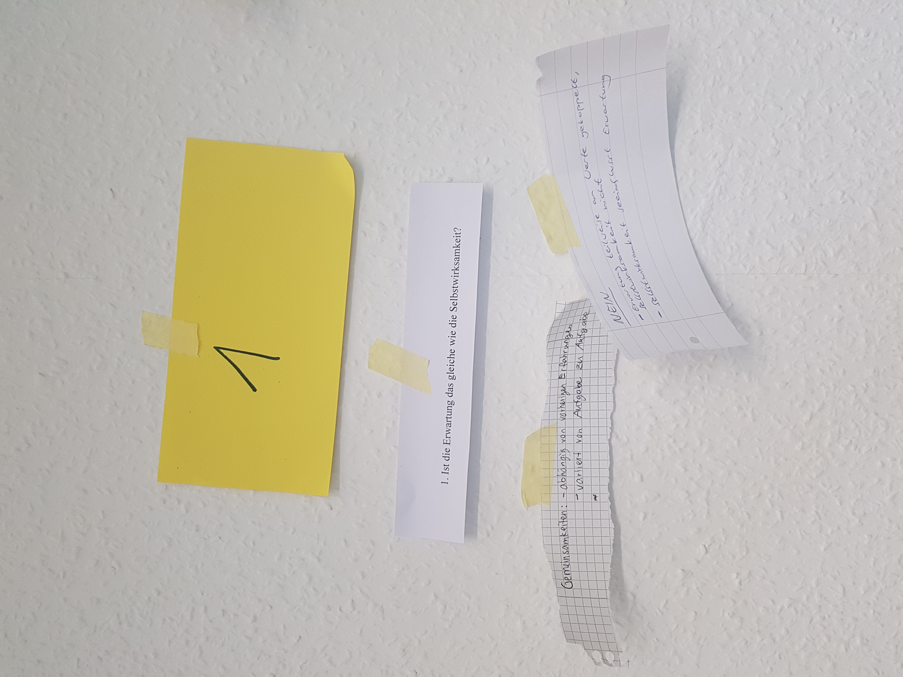
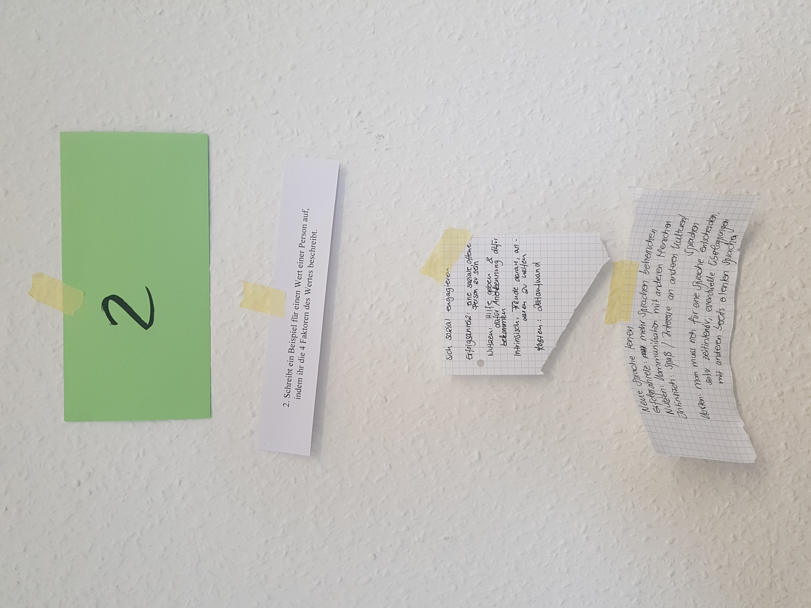
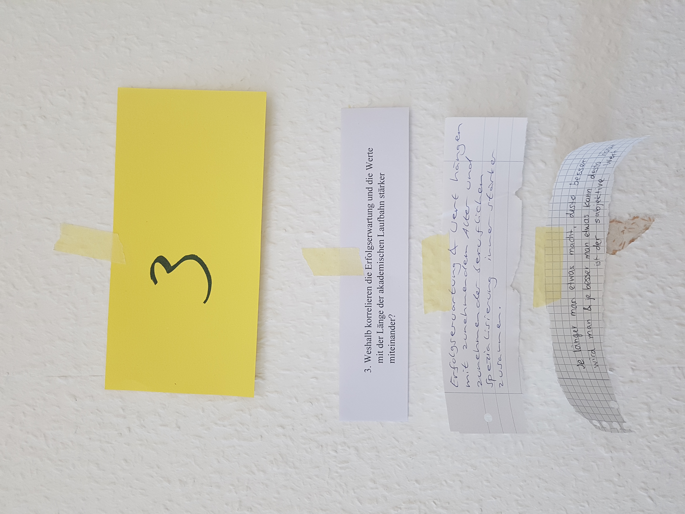
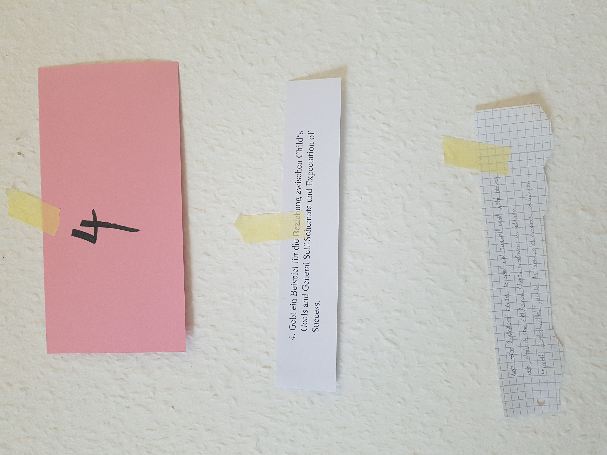
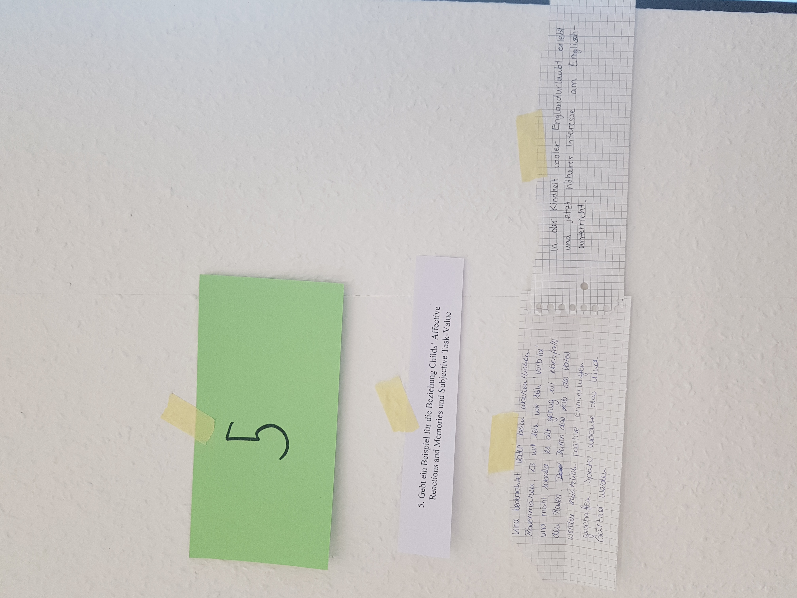
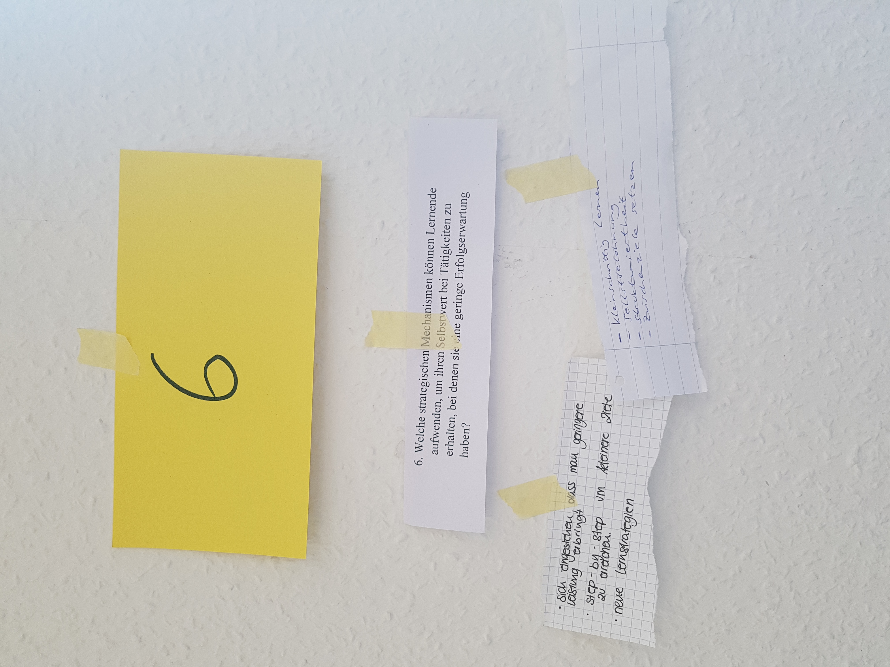

1. Ist die Erwartung das gleiche wie die Selbstwirksamkeit? 
2. Schreibt ein Beispiel für einen Wert einer Person auf, indem ihr die 4 Faktoren des Wertes beschreibt.
3. Weshalb korrelieren die Erfolgserwartung und die Werte mit der Länge der akademischen Laufbahn stärker miteinander? 
4. Gebt ein Beispiel für die Beziehung zwischen Child‘s Goals and General Self-Schemata und Expectation of Success. 
5. Gebt ein Beispiel für die Beziehung Childs‘ Affective Reactions and Memories und Subjective Task-Value
6. Welche strategischen Mechanismen können Lernende aufwenden, um ihren Selbstwert bei Tätigkeiten zu erhalten, bei denen sie eine geringe Erfolgserwartung haben? 

